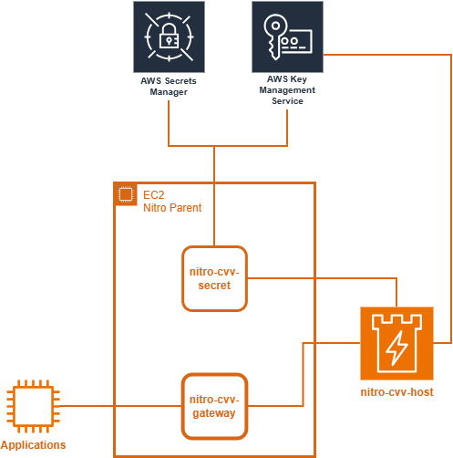

# nitro-enclave-cvv

**Experimental CVV Calculation using AWS Nitro Enclaves (Rust)**

This repository is a **learning-driven proof of concept** that explores how **AWS Nitro Enclaves** can be used to perform **CVV (Card Verification Value) calculation** inside a hardware-isolated environment using **Rust**.

The project demonstrates how sensitive cryptographic logic can be isolated from the EC2 parent instance while still supporting controlled request/response flows.

> ⚠️ This project is **not production-ready**, **not PCI-DSS compliant**, and **not security-audited**.  
> It exists purely for experimentation and learning.
---

## Architecture Overview

The system is composed of multiple Rust components running either on the **EC2 parent instance** or inside the **Nitro Enclave**.

## AWS Resource & Links:
- [Using cryptographic attestation with AWS KMS](https://docs.aws.amazon.com/enclaves/latest/user/kms.html)
